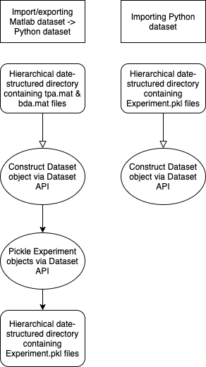
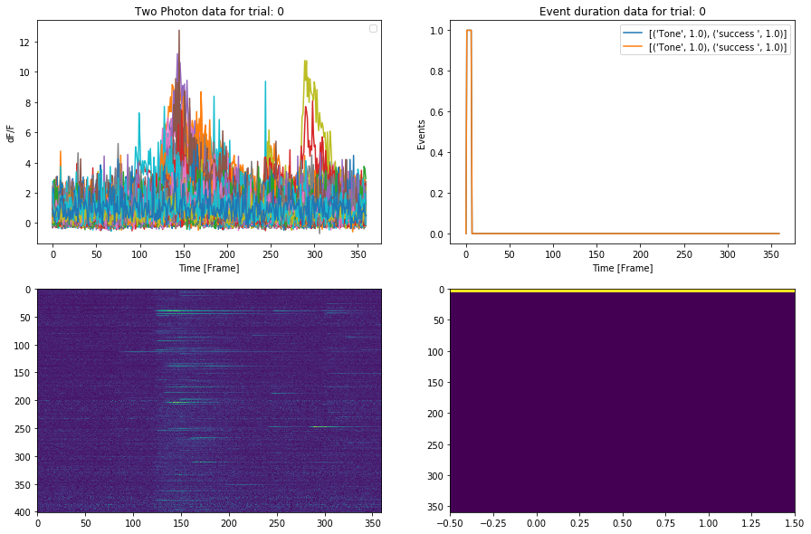

```
______      _____                     _                      _  ______                        
| ___ \    |  ___|                   (_)                    | | | ___ \                       
| |_/ /   _| |____  ___ __   ___ _ __ _ _ __ ___   ___ _ __ | |_| |_/ /_ _ _ __ ___  ___ _ __ 
|  __/ | | |  __\ \/ / '_ \ / _ \ '__| | '_ ` _ \ / _ \ '_ \| __|  __/ _` | '__/ __|/ _ \ '__|
| |  | |_| | |___>  <| |_) |  __/ |  | | | | | | |  __/ | | | |_| | | (_| | |  \__ \  __/ |   
\_|   \__, \____/_/\_\ .__/ \___|_|  |_|_| |_| |_|\___|_| |_|\__\_|  \__,_|_|  |___/\___|_|   
       __/ |         | |                                                                      
      |___/          |_|                                                                               
```

[WORK IN PROGRESS] Parser for neuronal data

## Features

* object-oriented design
* multiprocesses support
* friendly runtime info

## Getting Started

### Prerequisites

Use `config.json` to set running parameters.

### Installing and Running

```shell
# run under `pyexperimentparser` directory
# create vitual environment
python3 -m virtualenv .env
# enter virtual environment
source .env/bin/activate
# install required packages
pip3 install -r requirements.txt
# run the project
python3 main.py
# exit virtual environment
deactivate
```

The i/o flow is described below:



The output including data, figure and other analysis is put under path `out/` by default. The following figure demonstrates the result of the current config file.



### Debug

For debugging purpose or more running time info, please run with `--debug` flag. Otherwise, errors generated by subprocesses may not be revealed.

```
# this may heavily increase running time
python3 main.py --debug
```

## Running the Tests

```shell
# run all unit tests
python3 -m unittest discover
```

## License

## Acknowledgments

* This readme file is following the style of [README-Template.md](https://gist.github.com/PurpleBooth/109311bb0361f32d87a2).
* The title is generated by [TAAG](http://patorjk.com/software/taag/#p=display&f=Graffiti&t=Type%20Something%20).


## References

## Contributors

* Chester Holtz, chholtz@eng.ucsd.edu

## TODO

* Refactor directoory & dependance structure
* Separate subprojects
* Review imports
* joblib/multithreading 
* Figure out a way to eliminate pymatlab engine dependency
